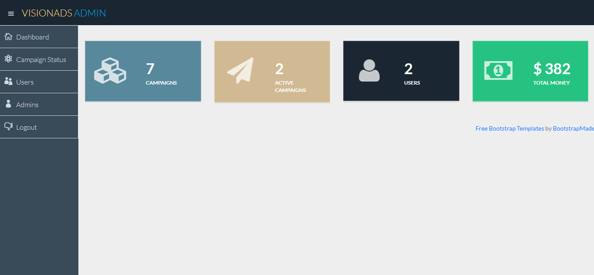

# Visionads

Visionads is a project for ad campaign management.

## Installation

Create mySql database with the name of visionads, import the sql file visionads.sql in phpmyadmin panel

You need Xampp or WAMP or laragon for running locally, in windows 10.

## Usage

The admin password and User password are following

***localhost/visionads/admin***

for accessing admin : **Username: voodoo** & **Password: magick** also **Username: shishir** & **Password: secret**

***/localhost/visionads/login.php***

for user login: **Username: shishir** & **Password: secret**

## Screenshots

## Contributing
Pull requests are welcome. For major changes, please open an issue first to discuss what you would like to change.

Please make sure to update tests as appropriate.

## License
[MIT](https://choosealicense.com/licenses/mit/)